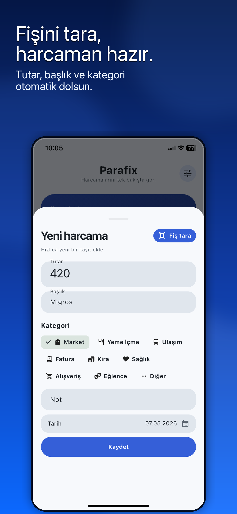
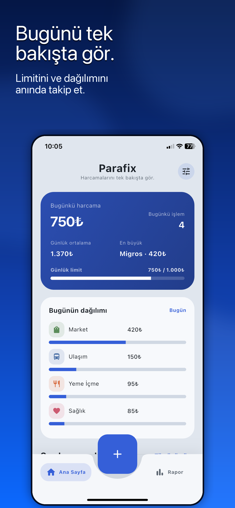
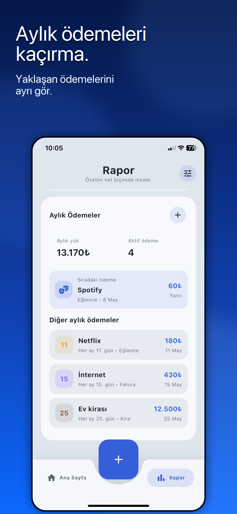
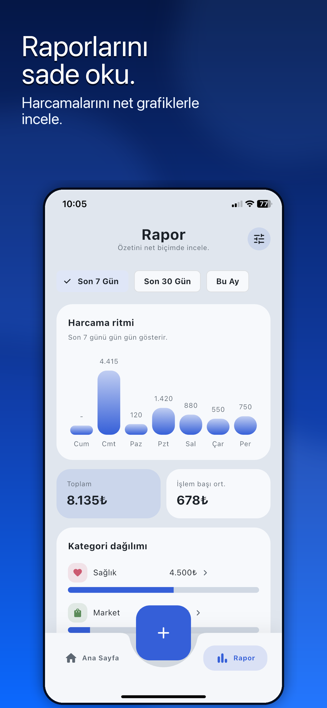
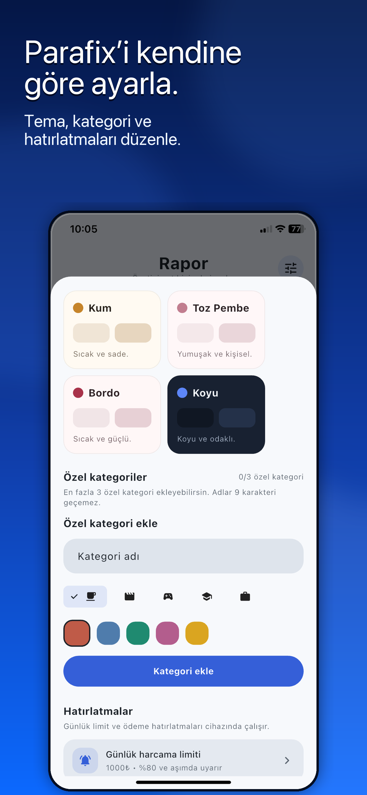

# Parafix


[App Store'da görüntüle](https://apps.apple.com/tr/app/parafix/id6764666105?l=tr)

Parafix, günlük harcamaları hızlıca kaydetmek ve nereye para gittiğini sade bir ekranda görmek için geliştirdiğim Flutter uygulaması.

Amacım çok karmaşık bir finans uygulaması yapmak değil. Parafix'in odağı basit: harcamayı ekle, özetini gör, gerekirse rapora bak.

## Neler Var?

- Harcama ekleme, düzenleme ve silme
- Fiş fotoğrafından hızlı harcama doldurma
- Ana sayfada bugün, son 7 gün ve bu ay özeti
- Günlük harcama limiti ve hatırlatmalar
- Son 7 günlük harcama akışı
- Gün detay ekranı
- Rapor ekranında dönem filtreleri
- Kategori bazlı harcama dağılımı
- Aylık ödemeler ve abonelik takibi
- Kullanıma göre kategori önerisi
- Tema seçimi
- Özel kategori ekleme
- Cihaz içinde yerel veri saklama

## Ekran Görüntüleri

| Fiş Tara | Bugünkü Özet | Aylık Ödemeler |
| --- | --- | --- |
|  |  |  |

| Rapor | Kişiselleştir |
| --- | --- |
|  |  |

## Teknolojiler

- Flutter
- Dart
- `shared_preferences`
- `flutter_slidable`
- Material 3

## Çalıştırma

```bash
flutter pub get
flutter run
```

Bağlı cihazları görmek için:

```bash
flutter devices
```

## Proje Yapısı

```text
lib/
  app/         uygulama kabuğu ve veri akışı
  core/        tema sistemi
  features/    ana sayfa, rapor, harcama ekleme, ayarlar
  models/      harcama, kategori ve aylık ödeme modelleri
```

## Durum

Parafix aktif olarak geliştiriliyor. Şu an odaklandığım konular:

- iOS tarafında daha iyi bir ilk sürüm hazırlamak
- Android deneyimini kademeli olarak iyileştirmek
- Aylık ödemeler akışını daha kullanışlı hale getirmek
- Küçük ekranlarda arayüzü daha rahat hale getirmek
- Genel arayüz polish'ini sürdürmek
